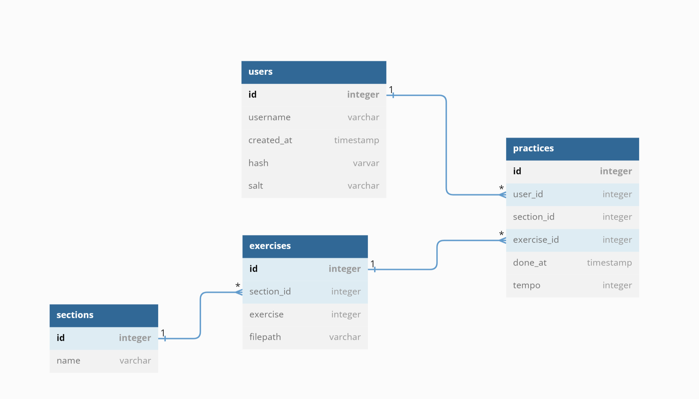

# practice-pal

teach me stick control

## WIP

To generate CSS: `npm run css-build`

https://developer.mozilla.org/en-US/docs/Learn/Server-side/Express_Nodejs/development_environment



## Dependencies

SQLite (3)

```
sudo apt install sqlite3
```

### Warning

Built heavily with ChatGPT. This thing is nuts.
